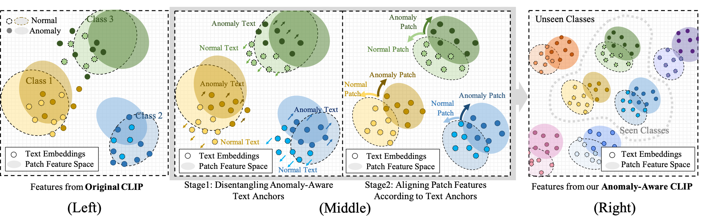
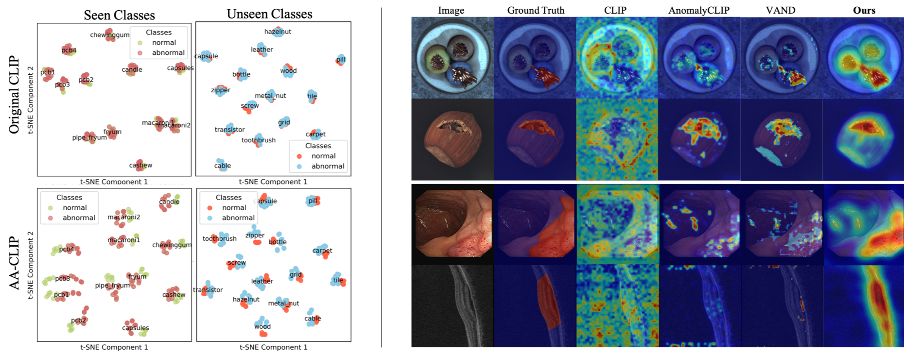

# AA-CLIP: Enhancing Zero-shot Anomaly Detection via Anomaly-Aware CLIP
 **[CVPR 2025 paper]**

[](https://arxiv.org/pdf/2503.06661) 
<!-- [](https://your-project-page.com) 
[](https://github.com/yourusername/repo)   -->
 Official Pytorch Implementation



## Abstract
Anomaly detection (AD) identifies outliers for applications like defect and lesion detection. While CLIP shows promise for zero-shot AD tasks due to its strong generalization capabilities, its inherent **Anomaly-Unawareness** leads to limited discrimination between normal and abnormal features. To address this problem, we propose **Anomaly-Aware CLIP** (AA-CLIP), which enhances CLIP's anomaly discrimination ability in both text and visual spaces while preserving its generalization capability. AA-CLIP is achieved through a straightforward yet effective two-stage approach: it first creates anomaly-aware text anchors to differentiate normal and abnormal semantics clearly, then aligns patch-level visual features with these anchors for precise anomaly localization. This two-stage strategy, with the help of residual adapters, gradually adapts CLIP in a controlled manner, achieving effective AD while maintaining CLIP's class knowledge. Extensive experiments validate AA-CLIP as a resource-efficient solution for zero-shot AD tasks, achieving state-of-the-art results in industrial and medical applications. 

## Results


## Quick Start 
### 1. Installation  
```bash
git clone https://github.com/Mwxinnn/AA-CLIP.git
cd AA-CLIP
conda create -n aaclip python=3.10 -y  
conda activate aaclip  
pip install -r requirements.txt  
```
### 2. Datasets
The datasets can be downloaded from [MVTec-AD](https://www.mvtec.com/company/research/datasets/mvtec-ad/), [VisA](https://github.com/amazon-science/spot-diff), [MPDD](https://github.com/stepanje/MPDD), [BrainMRI, LiverCT, Retinafrom](https://drive.google.com/drive/folders/1La5H_3tqWioPmGN04DM1vdl3rbcBez62?usp=sharing) from [BMAD](https://github.com/DorisBao/BMAD), [CVC-ColonDB, CVC-ClinicDB, Kvasir, CVC-300](https://figshare.com/articles/figure/Polyp_DataSet_zip/21221579) from Polyp Dataset.

Put all the datasets under ``./data`` and use jsonkl files in ``./dataset/metadata/``. You can use your own dataset and generate personalized jsonl files with below format:
```json
{"image_path": "xxxx/xxxx/xxx.png", 
 "label": 1.0 # or 0.0, 
 "class_name": "xxxx", 
 "mask_path": "xxxx/xxxx/xxx.png"}
```

(Optional) the base data directory can be edited in ``./dataset/constants``. If you want to reproduce the results with few-shot training, you can generate corresponding jsonl files and put them in ``./dataset/metadata/{$dataset}`` with ``{$shot}-shot.jsonl`` as the file name. For few-shot training, we use ``$shot`` samples from each category to train the model.

> Notice: Since the anomaly scenarios in VisA are closer to real situations, the default hyper-parameters are set according to the results trained on VisA. More analysis and discussion will be available.

### 3. Training & Evaluation
```bash
# training
python train.py --shot $shot --save_path $save_path
# evaluation
python test.py --save_path $save_path --dataset $dataset
# (Optional) we provide bash script for training and evaluating all the datasets
bash scripts.sh
```
Model definition is in ``./model/``. We thank [```open_clip```](https://github.com/mlfoundations/open_clip.git) for being open-source. To run the code, one has to download the weight of OpenCLIP ViT-L-14-336px and put it under ```./model/```.


## Citation
If you use this work, please cite:
```
@misc{ma2025aaclipenhancingzeroshotanomaly,
      title={AA-CLIP: Enhancing Zero-shot Anomaly Detection via Anomaly-Aware CLIP}, 
      author={Wenxin Ma and Xu Zhang and Qingsong Yao and Fenghe Tang and Chenxu Wu and Yingtai Li and Rui Yan and Zihang Jiang and S. Kevin Zhou},
      year={2025},
      eprint={2503.06661},
      archivePrefix={arXiv},
      primaryClass={cs.CV},
      url={https://arxiv.org/abs/2503.06661}, 
}
```

## Contact
For questions or collaborations:

- Email: mwxisj@gmail.com

- GitHub Issues: [Open Issue](https://github.com/Mwxinnn/AA-CLIP/issues)

⭐ Star this repo if you find it useful!